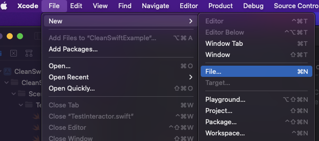
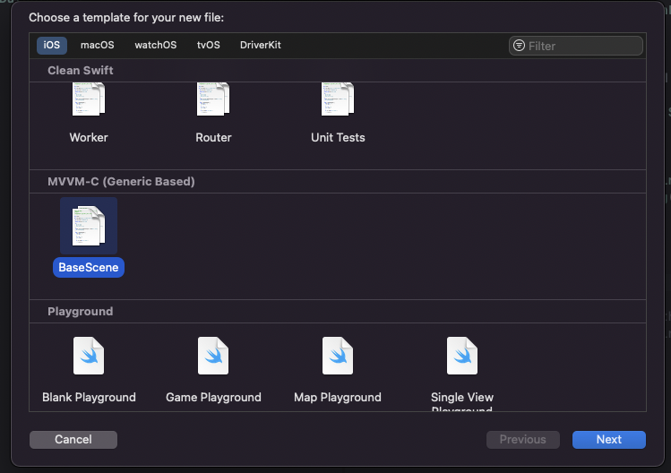
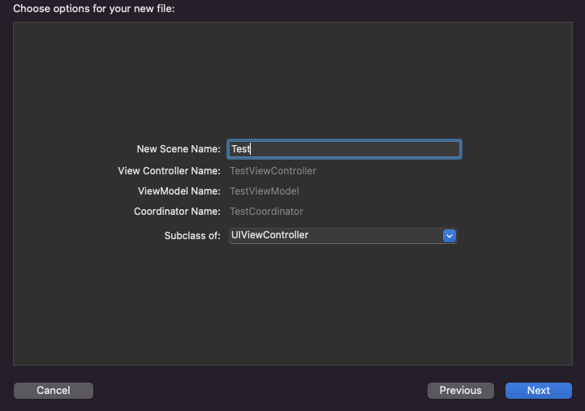
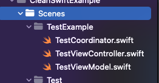

# Required MVVM-C Templates
Required by Generic Type ViewController & ViewModel

```
class BaseViewController<U>: UIViewController, BaseViewControllerProtocol ...
class BaseViewModel<U, A>: NSObject, BaseViewModelProtocol ...
class TestCoordinator: BaseCoordinator ...
```


# Installation
1. Move to dirctory `cd MVVM-C`
2. run makeFile `make install_templates`
- Locate to : `~/Library/Developer/Xcode/Templates/File\ Templates` 
3. Finish

# UnInstallation
1. Move to dirctory `cd MVVM-C`
2. run makeFile `make uninstall_templates`
3. Finish


## Example usage
Lets say we want to add a login screen to our application. It will receive input from user, which will be validated and finally it will display a succes or failure reponse.
For that please do:
1. Click on 'add new file' in Xcode, and click Next



2. In your template list go down and choose 'Scene' under 'Clean Swift' section



3. type 'Test' for your new scene name. It should inherit from UIViewController.



You should see that all 6 files were added to your project



Finally, lets write some code!

